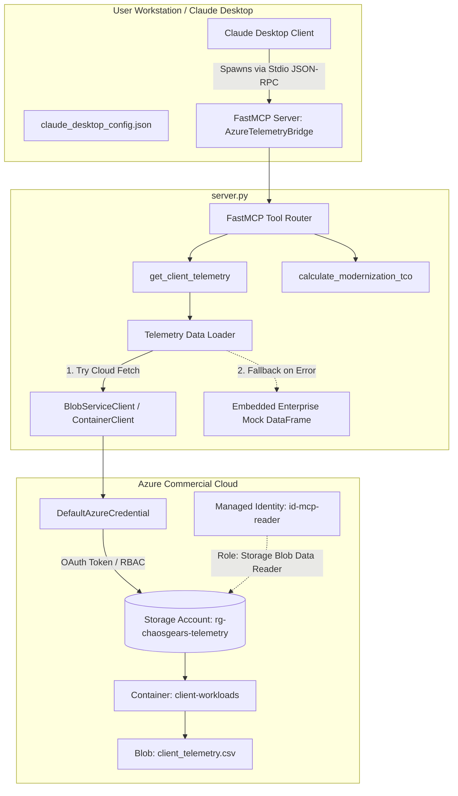

# Architecture Research: Azure Telemetry Bridge MCP

**Domain:** Claude Desktop MCP Server & Azure Cloud Telemetry Architecture  
**Date:** 2026-09-07  
**Status:** Complete  

## System Architecture Diagram

## Component Breakdown

1. **Claude Desktop Integration Layer (`claude_desktop_config.json`)**:
   - Spawns Python virtual environment interpreter executing `server.py`.
   - Injects environment variables (`AZURE_STORAGE_ACCOUNT_NAME`, `AZURE_STORAGE_CONTAINER_NAME`, `AZURE_STORAGE_BLOB_NAME`).
   - JSON-RPC communication strictly over `sys.stdin` and `sys.stdout`.

2. **Server & Tool Core (`server.py`)**:
   - Built on `mcp.server.fastmcp.FastMCP`.
   - Logging routed strictly to `sys.stderr` (ensures `sys.stdout` remains pristine JSON-RPC).
   - In-memory caching/singleton data loader to avoid redundant downloads on every query.
   - Robust DataFrame validation with column types: `client_id` (str), `workload_name` (str), `monthly_db_queries` (int), `storage_tb` (float), `current_monthly_spend_usd` (float).

3. **Cloud Infrastructure Layer (`terraform/`)**:
   - Resource Group: `rg-chaosgears-telemetry` (configurable via variables).
   - Storage Account: Secure baseline (`account_tier = "Standard"`, `account_replication_type = "LRS"`, `min_tls_version = "TLS1_2"`, `is_hns_enabled = false`).
   - Blob Container: `client-workloads` (`container_access_type = "private"`).
   - Blob: `client_telemetry.csv` populated with initial client telemetry dataset.
   - Identity & RBAC: `azurerm_user_assigned_identity` (`id-mcp-reader`) assigned `Storage Blob Data Reader` role on the storage account scope.
   - Clean Terraform outputs exposing storage account name, blob container name, primary blob endpoint, and identity client ID.

4. **Testing & CI Pipeline (`tests/test_server.py`, `.github/workflows/ci.yml`)**:
   - Pytest suite using `unittest.mock.patch` for `BlobServiceClient` and `DefaultAzureCredential`.
   - Tests run completely offline and verify fallback behavior, valid client queries, invalid client ID handling, and deterministic mathematical accuracy of the TCO calculator.
   - GitHub Actions CI matrix executing Ruff linting and pytest under Python 3.11.
