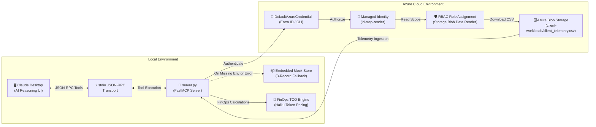

<div align="center">

# 🌉 Claude Desktop Azure Telemetry Bridge MCP Server

**Enterprise Model Context Protocol (MCP) Server connecting Claude Desktop with Azure Blob Storage for Deterministic Cloud Modernization & AI TCO Assessments.**

[](https://www.python.org/)
[](https://modelcontextprotocol.io/)
[](https://azure.microsoft.com/)
[](https://www.terraform.io/)
[](https://github.com/astral-sh/ruff)
[](LICENSE)

</div>

---

## 📖 Executive Summary

The **Claude Desktop Azure Telemetry Bridge** is an internal enterprise harness built for Cloud Alliances, Solutions Architects, and FinOps teams. It enables Claude Desktop to securely query client workload telemetry stored in Azure Blob Storage via standard Model Context Protocol (`stdio`) and compute audit-ready, transparent cloud modernization TCO models paired with Anthropic Claude Haiku token reasoning economics.

### Key Capabilities
- 🔐 **Zero-Secret Cloud Security:** Authenticates using `azure.identity.DefaultAzureCredential` supporting local Azure CLI authentication and cloud-native Managed Identities without hardcoded secrets.
- 🛡️ **Graceful Offline Fallback:** Automatically switches to an embedded 3-record enterprise client dataset (Retail, FinTech, Logistics) with explicit warnings if Azure credentials or network connectivity are unavailable.
- 📊 **Deterministic FinOps Sizing:** Models an empirical 30% baseline infrastructure cost reduction from modernization (serverless refactoring, automated blob lifecycle tiering, rightsizing) coupled with high-throughput Claude Haiku token reasoning costs.
- ⚡ **Turnkey IaC Automation:** Fully declarative HashiCorp Terraform modules provisioning Azure Resource Group, Storage Account (TLS 1.2, flat blob storage), private Blob Container, seed dataset upload, User Assigned Managed Identity, and least-privilege `Storage Blob Data Reader` RBAC assignment.

---

## 🏗️ Architecture



---

## 🛠️ MCP Tools Reference

### 1. `get_client_telemetry`
Retrieves granular cloud metrics and telemetry for a specific enterprise account with case-insensitive identifier matching.

- **Parameters:**
  - `client_id` (*string*, required): Unique client identifier (e.g., `RETAIL-001`, `FINTECH-002`, `LOGISTICS-003`).
- **Sample Output:**
  ```markdown
  ### 📊 Telemetry Profile: RETAIL-001 — Global Retail Omnichannel

  - **Industry Vertical:** Retail & E-commerce
  - **Current Monthly Cloud Spend:** $125,000.00
  - **Workload Storage Volume:** 15.4 TB
  - **Monthly Database Queries:** 15,400,000
  - **Active Virtual Machines:** 240
  - **Estimated AI Reasoning Queries (Monthly):** 45,000
  ```

### 2. `calculate_modernization_tco`
Computes modernization Total Cost of Ownership (TCO) comparing legacy spend against modernized cloud infrastructure plus Anthropic Claude Haiku token migration economics.

- **Parameters:**
  - `current_spend_usd` (*number*, required): Current monthly cloud infrastructure spend in USD (>= 0).
  - `estimated_ai_monthly_queries` (*integer*, required): Anticipated monthly AI reasoning / analysis queries (>= 0).
- **Economic Assumptions:**
  - **Modernization Savings:** 30% reduction on current cloud spend.
  - **LLM Model:** Anthropic Claude 3.5 Haiku ($0.80 / MTok input, $4.00 / MTok output).
  - **Workload Sizing:** 1,500 input tokens + 500 output tokens = **$0.003200 per query**.
- **Sample Output:**
  ```markdown
  ## ☁️ Cloud Modernization & AI TCO Assessment

  ### 1. Baseline Workload Inputs
  - **Current Monthly Cloud Spend:** $100,000.00
  - **Projected Monthly AI Queries:** 50,000

  ### 2. Modernized Infrastructure Sizing (30% Efficiency Gain)
  - **Modernized Monthly Infra Spend:** $70,000.00
  - **Gross Monthly Infra Savings:** $30,000.00

  ### 3. Anthropic Claude Haiku Token Economics
  - **Model:** Claude 3.5 Haiku ($0.80/M input tokens, $4.00/M output tokens)
  - **Per-Query Profile:** 1,500 input tokens + 500 output tokens
  - **Unit Cost per Query:** $0.003200
  - **Monthly AI Reasoning Cost:** $160.00

  ### 4. Executive FinOps Summary
  - **Projected Net Monthly Spend:** $70,160.00
  - **Net Projected Monthly Savings:** $29,840.00
  - **Annualized Projected Savings:** $358,080.00
  - **Net Cost Reduction (ROI):** 29.8%
  ```

---

## 🚀 Quickstart & Local Setup

### Prerequisites
- **Python:** Version 3.11 or higher
- **Terraform:** Version 1.5.0 or higher (optional, for Azure cloud provisioning)
- **Azure CLI:** (optional, for live Azure authentication via `az login`)

### 1. Clone & Initialize Environment
```bash
git clone https://github.com/your-org/claude-desktop-azure-telemetry-bridge.git
cd claude-desktop-azure-telemetry-bridge

# Create and activate Python virtual environment
python -m venv .venv

# On Windows PowerShell:
.\.venv\Scripts\Activate.ps1

# On macOS/Linux:
source .venv/bin/activate

# Install dependencies
pip install -r requirements.txt
```

### 2. Run Offline Mock Mode (Zero Setup Required)
You can run and test the server immediately without Azure access. The server gracefully detects missing credentials and activates the embedded catalog:
```bash
# Verify offline loading
python -c "import server; print(server.get_client_telemetry('RETAIL-001'))"
```

---

## ☁️ Terraform Cloud Infrastructure

To provision the live Azure infrastructure:

```bash
cd terraform

# Initialize providers (azurerm, random)
terraform init

# Validate configuration
terraform validate

# Plan deployment
terraform plan -out=tfplan

# Apply deployment to your Azure subscription
terraform apply tfplan
```

### Terraform Outputs
After provisioning, Terraform will display output values needed for your Claude Desktop configuration:
```
Outputs:
storage_account_name       = "claudetelxyz123"
storage_container_name     = "client-workloads"
primary_blob_endpoint      = "https://claudetelxyz123.blob.core.windows.net/"
managed_identity_client_id = "00000000-0000-0000-0000-000000000000"
telemetry_blob_name        = "client_telemetry.csv"
```

---

## 🖥️ Claude Desktop Integration

To connect this MCP server to Claude Desktop:

1. Open your Claude Desktop configuration file:
   - **Windows:** `%APPDATA%\Claude\claude_desktop_config.json`
   - **macOS:** `~/Library/Application Support/Claude/claude_desktop_config.json`

2. Add the `azure-telemetry-bridge` entry:
   ```json
   {
     "mcpServers": {
       "azure-telemetry-bridge": {
         "command": "<ABSOLUTE_PATH_TO_YOUR_VENV>\\Scripts\\python.exe",
         "args": [
           "<ABSOLUTE_PATH_TO_YOUR_REPO>\\server.py"
         ],
         "env": {
           "AZURE_STORAGE_ACCOUNT_NAME": "<YOUR_AZURE_STORAGE_ACCOUNT_NAME>",
           "AZURE_CONTAINER_NAME": "client-workloads",
           "AZURE_BLOB_NAME": "client_telemetry.csv"
         }
       }
     }
   }
   ```
   *(Note: For offline mock mode, omit or leave `AZURE_STORAGE_ACCOUNT_NAME` blank).*

3. Restart Claude Desktop. The 🔨 tool icon will indicate that `get_client_telemetry` and `calculate_modernization_tco` are available!

---

## 🧪 Testing & Code Quality

The repository includes a comprehensive, 100% offline test suite using `pytest` and code quality enforcement via `ruff`:

```bash
# Run unit and integration tests
pytest -v tests/

# Run Ruff linter
ruff check .

# Run Ruff code format verification
ruff format --check .
```

---

## 📂 Project Structure

```
.
├── .github/
│   └── workflows/
│       └── ci.yml                     # GitHub Actions CI (Python 3.11 lint & test)
├── .gitignore                         # Enterprise git exclusion rules
├── claude_desktop_config.example.json # Turnkey Claude Desktop configuration template
├── requirements.txt                   # Production dependencies (FastMCP, Azure SDK, Pandas, Pytest, Ruff)
├── server.py                          # FastMCP server with DefaultAzureCredential & FinOps tools
├── terraform/
│   ├── client_telemetry.csv           # Enterprise seed dataset (Retail, FinTech, Logistics)
│   ├── main.tf                        # Azure RG, Storage, Container, Blob, Identity, RBAC
│   ├── outputs.tf                     # Exported connection attributes
│   └── variables.tf                   # Parameterized inputs with defaults
└── tests/
    ├── __init__.py
    └── test_server.py                 # 14 offline unit & integration tests
```

---

## 📄 License
Distributed under the **MIT License**. See `LICENSE` for more information.
